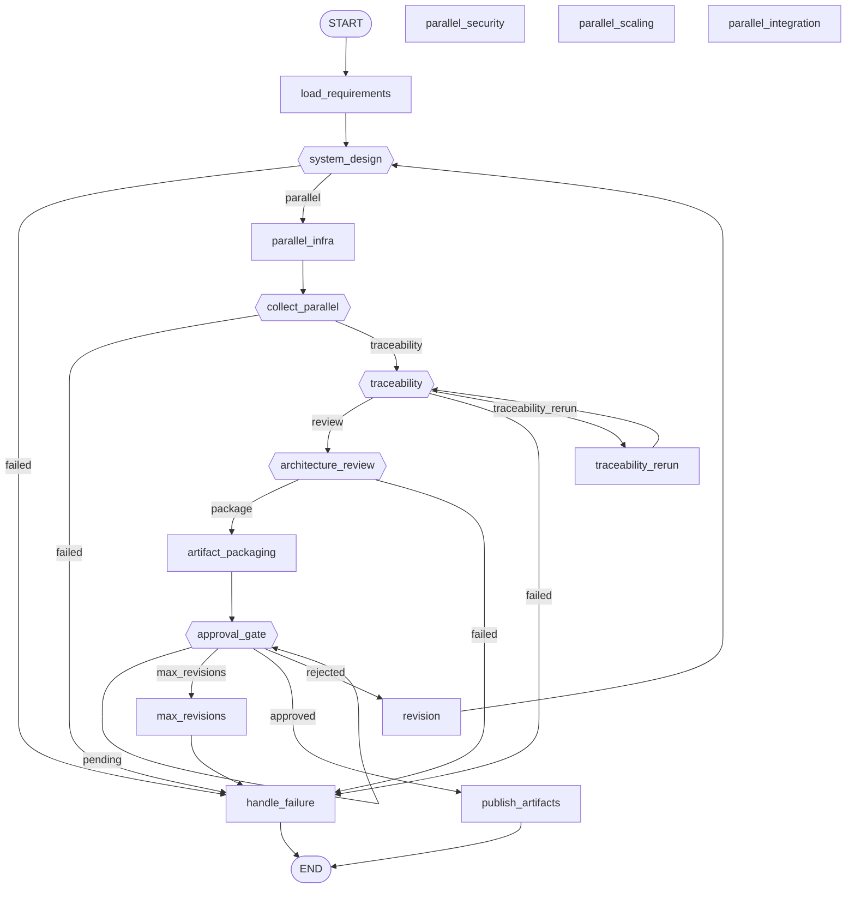

# Workflow: architecture

**Status:** ✓ healthy

## Purpose

Turns approved product requirements into a reviewed, versioned system design (infra, security, scaling, integration) ready for Engineering.

## Nodes

- **Entry:** `load_requirements`
- **Finish:** `__end__`
- **All nodes (18):** `__end__`, `__start__`, `approval_gate`, `architecture_review`, `artifact_packaging`, `collect_parallel`, `handle_failure`, `load_requirements`, `max_revisions`, `parallel_infra`, `publish_artifacts`, `revision`, `system_design`, `traceability`, `traceability_rerun`

## Routing Table

| Source Node | Routing Function | Outcome | Target |
|---|---|---|---|
| system_design | route_after_system_design | failed | handle_failure |
| system_design | route_after_system_design | parallel | parallel_infra |
| collect_parallel | route_after_parallel | failed | handle_failure |
| collect_parallel | route_after_parallel | traceability | traceability |
| traceability | route_after_traceability | failed | handle_failure |
| traceability | route_after_traceability | review | architecture_review |
| traceability | route_after_traceability | traceability_rerun | traceability_rerun |
| architecture_review | route_after_review | failed | handle_failure |
| architecture_review | route_after_review | package | artifact_packaging |
| approval_gate | route_approval_gate | approved | publish_artifacts |
| approval_gate | route_approval_gate | max_revisions | max_revisions |
| approval_gate | route_approval_gate | pending | approval_gate |
| approval_gate | route_approval_gate | rejected | revision |

## Parallel Branches

| Fan-out Node | Kind | Targets |
|---|---|---|
| fan_out_parallel_design | send | parallel_infra, parallel_integration, parallel_scaling, parallel_security |

## Interrupt Nodes

approval_gate

## Diagram

## Statistics

| Metric | Value |
|---|---|
| Nodes | 18 |
| Edges | 22 |
| Graph depth | 11 |
| Average branching factor | 1.57 |
| Reachability | 83.3% |
| Dead ends | 0 |
| Cycles detected | 3 |
| Interrupt nodes | approval_gate |
| Checkpoint-capable | yes |
| Parallel branches | 1 |

## Warnings

- node(s) ['parallel_integration', 'parallel_scaling', 'parallel_security'] are only reachable via a runtime Send() fan-out — not a static-analysis failure, see lifecycle.py

## Errors

_None._
