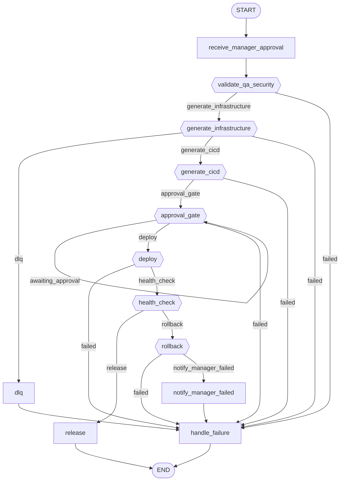

# Workflow: devops

**Status:** ✓ healthy

## Purpose

Provisions infrastructure and deploys reviewed artifacts, gated on a manager approval.

## Nodes

- **Entry:** `receive_manager_approval`
- **Finish:** `__end__`
- **All nodes (14):** `__end__`, `__start__`, `approval_gate`, `deploy`, `dlq`, `generate_cicd`, `generate_infrastructure`, `handle_failure`, `health_check`, `notify_manager_failed`, `receive_manager_approval`, `release`, `rollback`, `validate_qa_security`

## Routing Table

| Source Node | Routing Function | Outcome | Target |
|---|---|---|---|
| validate_qa_security | route_after_validate_qa_security | failed | handle_failure |
| validate_qa_security | route_after_validate_qa_security | generate_infrastructure | generate_infrastructure |
| generate_infrastructure | route_after_generate_infrastructure | dlq | dlq |
| generate_infrastructure | route_after_generate_infrastructure | failed | handle_failure |
| generate_infrastructure | route_after_generate_infrastructure | generate_cicd | generate_cicd |
| generate_cicd | route_after_generate_cicd | approval_gate | approval_gate |
| generate_cicd | route_after_generate_cicd | failed | handle_failure |
| approval_gate | route_after_approval_gate | awaiting_approval | approval_gate |
| approval_gate | route_after_approval_gate | deploy | deploy |
| approval_gate | route_after_approval_gate | failed | handle_failure |
| deploy | route_after_deploy | failed | handle_failure |
| deploy | route_after_deploy | health_check | health_check |
| health_check | route_after_health_check | release | release |
| health_check | route_after_health_check | rollback | rollback |
| rollback | route_after_rollback | failed | handle_failure |
| rollback | route_after_rollback | notify_manager_failed | notify_manager_failed |

## Parallel Branches

_No parallel branches._

## Interrupt Nodes

approval_gate

## Diagram

## Statistics

| Metric | Value |
|---|---|
| Nodes | 14 |
| Edges | 22 |
| Graph depth | 11 |
| Average branching factor | 1.69 |
| Reachability | 100.0% |
| Dead ends | 0 |
| Cycles detected | 1 |
| Interrupt nodes | approval_gate |
| Checkpoint-capable | yes |
| Parallel branches | 0 |

## Warnings

_None._

## Errors

_None._
