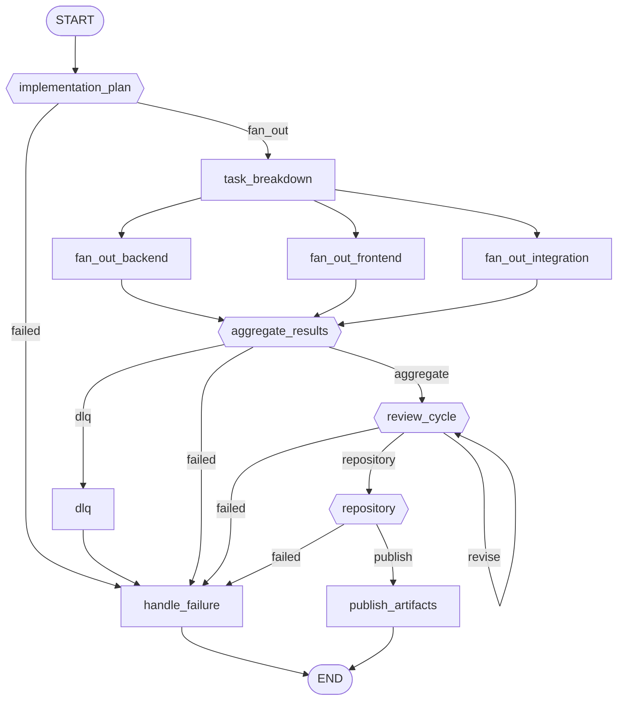

# Workflow: engineering

**Status:** ✓ healthy

## Purpose

Implements a feature: task breakdown, parallel backend/frontend/integration build-out, review cycles, and a merge-ready pull request.

## Nodes

- **Entry:** `implementation_plan`
- **Finish:** `__end__`
- **All nodes (13):** `__end__`, `__start__`, `aggregate_results`, `dlq`, `fan_out_backend`, `fan_out_frontend`, `fan_out_integration`, `handle_failure`, `implementation_plan`, `publish_artifacts`, `repository`, `review_cycle`, `task_breakdown`

## Routing Table

| Source Node | Routing Function | Outcome | Target |
|---|---|---|---|
| implementation_plan | route_after_plan | failed | handle_failure |
| implementation_plan | route_after_plan | fan_out | task_breakdown |
| aggregate_results | route_after_fan_out | aggregate | review_cycle |
| aggregate_results | route_after_fan_out | dlq | dlq |
| aggregate_results | route_after_fan_out | failed | handle_failure |
| review_cycle | route_after_review | failed | handle_failure |
| review_cycle | route_after_review | repository | repository |
| review_cycle | route_after_review | revise | review_cycle |
| repository | route_after_repository | failed | handle_failure |
| repository | route_after_repository | publish | publish_artifacts |

## Parallel Branches

| Fan-out Node | Kind | Targets |
|---|---|---|
| task_breakdown | static_edges | fan_out_backend, fan_out_frontend, fan_out_integration |

## Interrupt Nodes

_None._

## Diagram

## Statistics

| Metric | Value |
|---|---|
| Nodes | 13 |
| Edges | 20 |
| Graph depth | 8 |
| Average branching factor | 1.67 |
| Reachability | 100.0% |
| Dead ends | 0 |
| Cycles detected | 1 |
| Interrupt nodes | none |
| Checkpoint-capable | yes |
| Parallel branches | 1 |

## Warnings

_None._

## Errors

_None._
