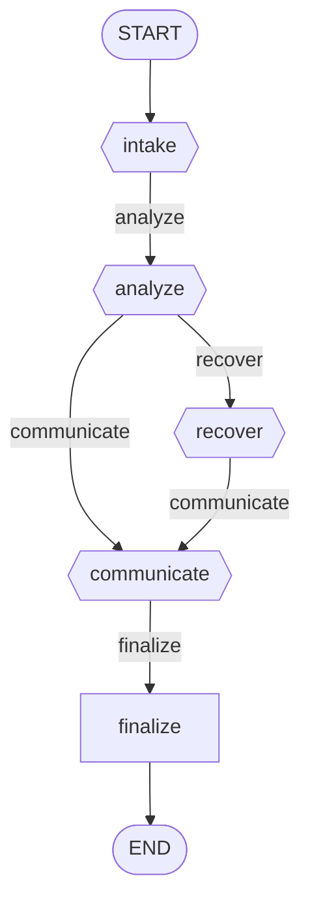

# Workflow: incident_response

**Status:** ✓ healthy

## Purpose

Reacts to raised alerts: triage, diagnosis, remediation, and post-incident report.

## Nodes

- **Entry:** `intake`
- **Finish:** `__end__`
- **All nodes (7):** `__end__`, `__start__`, `analyze`, `communicate`, `finalize`, `intake`, `recover`

## Routing Table

| Source Node | Routing Function | Outcome | Target |
|---|---|---|---|
| intake | route_after_intake | analyze | analyze |
| analyze | route_after_analyze | communicate | communicate |
| analyze | route_after_analyze | recover | recover |
| recover | route_after_recover | communicate | communicate |
| communicate | route_after_communicate | finalize | finalize |

## Parallel Branches

_No parallel branches._

## Interrupt Nodes

_None._

## Diagram

## Statistics

| Metric | Value |
|---|---|
| Nodes | 7 |
| Edges | 7 |
| Graph depth | 6 |
| Average branching factor | 1.17 |
| Reachability | 100.0% |
| Dead ends | 0 |
| Cycles detected | 0 |
| Interrupt nodes | none |
| Checkpoint-capable | yes |
| Parallel branches | 0 |

## Warnings

_None._

## Errors

_None._
