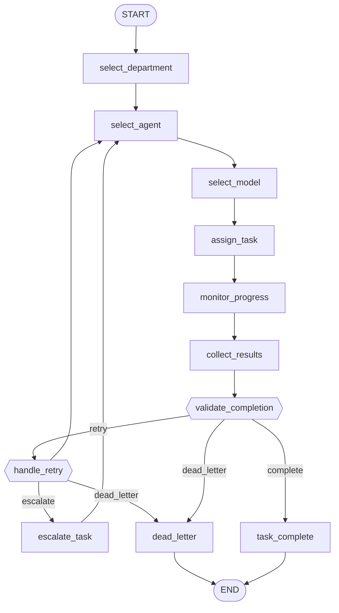

# Workflow: manager_delegation

**Status:** ✓ healthy

## Purpose

Per-task delegation loop: select department/agent/model, monitor progress, retry or escalate, validate completion.

## Nodes

- **Entry:** `select_department`
- **Finish:** `__end__`
- **All nodes (13):** `__end__`, `__start__`, `assign_task`, `collect_results`, `dead_letter`, `escalate_task`, `handle_retry`, `monitor_progress`, `select_agent`, `select_department`, `select_model`, `task_complete`, `validate_completion`

## Routing Table

| Source Node | Routing Function | Outcome | Target |
|---|---|---|---|
| validate_completion | route_after_validation | complete | task_complete |
| validate_completion | route_after_validation | dead_letter | dead_letter |
| validate_completion | route_after_validation | retry | handle_retry |
| handle_retry | route_escalation | dead_letter | dead_letter |
| handle_retry | route_escalation | escalate | escalate_task |

## Parallel Branches

_No parallel branches._

## Interrupt Nodes

_None._

## Diagram

## Statistics

| Metric | Value |
|---|---|
| Nodes | 13 |
| Edges | 16 |
| Graph depth | 10 |
| Average branching factor | 1.33 |
| Reachability | 100.0% |
| Dead ends | 0 |
| Cycles detected | 2 |
| Interrupt nodes | none |
| Checkpoint-capable | yes |
| Parallel branches | 0 |

## Warnings

_None._

## Errors

_None._
