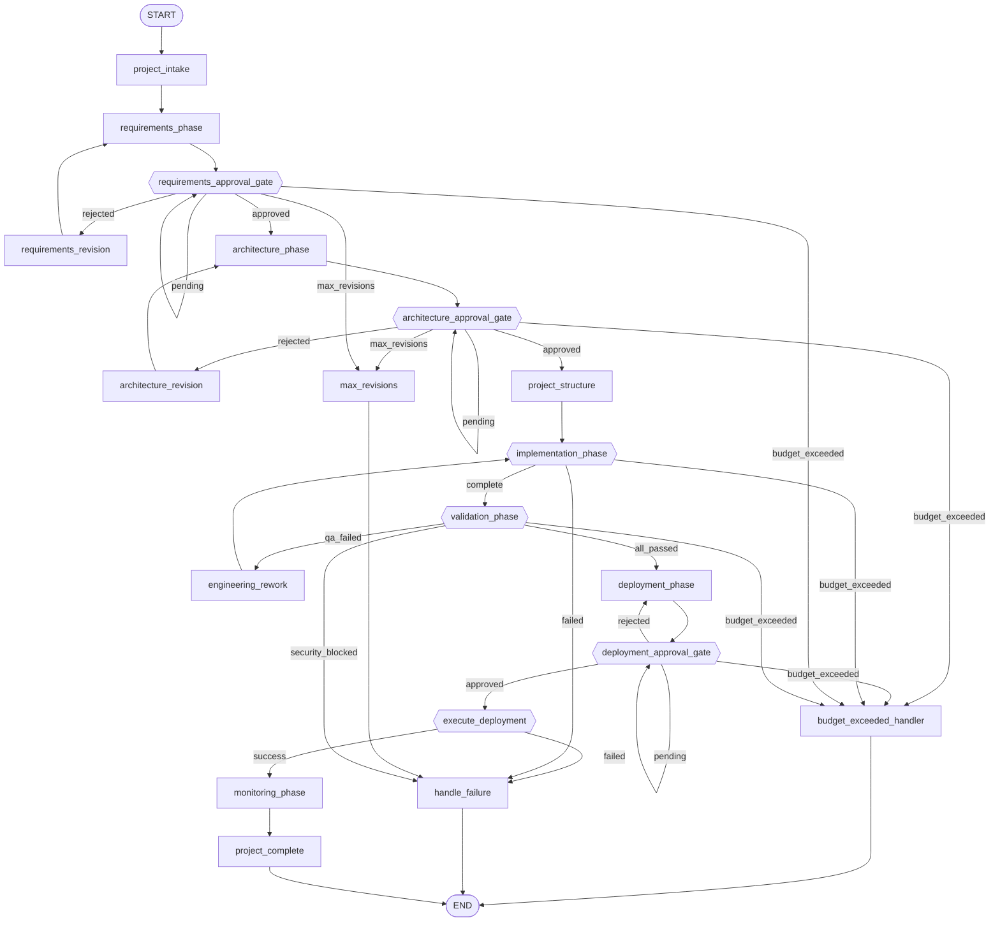

# Workflow: manager_lifecycle

**Status:** ✓ healthy

## Purpose

The project's end-to-end phase state machine — intake through deployment and monitoring hand-off, with approval gates at requirements/architecture/deployment.

## Nodes

- **Entry:** `project_intake`
- **Finish:** `__end__`
- **All nodes (21):** `__end__`, `__start__`, `architecture_approval_gate`, `architecture_phase`, `architecture_revision`, `budget_exceeded_handler`, `deployment_approval_gate`, `deployment_phase`, `engineering_rework`, `execute_deployment`, `handle_failure`, `implementation_phase`, `max_revisions`, `monitoring_phase`, `project_complete`, `project_intake`, `project_structure`, `requirements_approval_gate`, `requirements_phase`, `requirements_revision`, `validation_phase`

## Routing Table

| Source Node | Routing Function | Outcome | Target |
|---|---|---|---|
| requirements_approval_gate | route_requirements_approval | approved | architecture_phase |
| requirements_approval_gate | route_requirements_approval | budget_exceeded | budget_exceeded_handler |
| requirements_approval_gate | route_requirements_approval | max_revisions | max_revisions |
| requirements_approval_gate | route_requirements_approval | pending | requirements_approval_gate |
| requirements_approval_gate | route_requirements_approval | rejected | requirements_revision |
| architecture_approval_gate | route_architecture_approval | approved | project_structure |
| architecture_approval_gate | route_architecture_approval | budget_exceeded | budget_exceeded_handler |
| architecture_approval_gate | route_architecture_approval | max_revisions | max_revisions |
| architecture_approval_gate | route_architecture_approval | pending | architecture_approval_gate |
| architecture_approval_gate | route_architecture_approval | rejected | architecture_revision |
| implementation_phase | route_after_implementation | budget_exceeded | budget_exceeded_handler |
| implementation_phase | route_after_implementation | complete | validation_phase |
| implementation_phase | route_after_implementation | failed | handle_failure |
| validation_phase | route_validation | all_passed | deployment_phase |
| validation_phase | route_validation | budget_exceeded | budget_exceeded_handler |
| validation_phase | route_validation | qa_failed | engineering_rework |
| validation_phase | route_validation | security_blocked | handle_failure |
| deployment_approval_gate | route_deployment_approval | approved | execute_deployment |
| deployment_approval_gate | route_deployment_approval | budget_exceeded | budget_exceeded_handler |
| deployment_approval_gate | route_deployment_approval | pending | deployment_approval_gate |
| deployment_approval_gate | route_deployment_approval | rejected | deployment_phase |
| execute_deployment | route_after_deployment | failed | handle_failure |
| execute_deployment | route_after_deployment | success | monitoring_phase |

## Parallel Branches

_No parallel branches._

## Interrupt Nodes

architecture_approval_gate, deployment_approval_gate, requirements_approval_gate

## Diagram

## Statistics

| Metric | Value |
|---|---|
| Nodes | 21 |
| Edges | 37 |
| Graph depth | 14 |
| Average branching factor | 1.85 |
| Reachability | 100.0% |
| Dead ends | 0 |
| Cycles detected | 7 |
| Interrupt nodes | architecture_approval_gate, deployment_approval_gate, requirements_approval_gate |
| Checkpoint-capable | yes |
| Parallel branches | 0 |

## Warnings

_None._

## Errors

_None._
