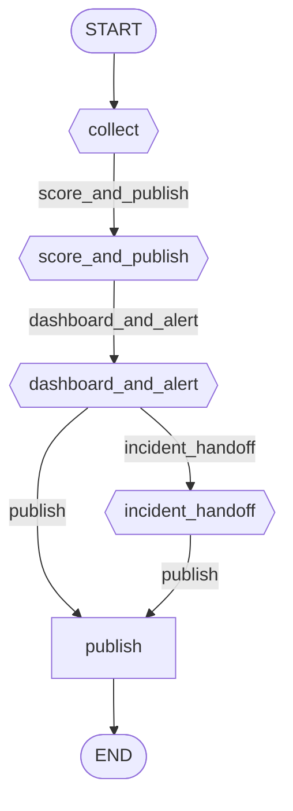

# Workflow: monitoring

**Status:** ✓ healthy

## Purpose

Continuously collects infrastructure/application/log/trace signals and raises alerts.

## Nodes

- **Entry:** `collect`
- **Finish:** `__end__`
- **All nodes (7):** `__end__`, `__start__`, `collect`, `dashboard_and_alert`, `incident_handoff`, `publish`, `score_and_publish`

## Routing Table

| Source Node | Routing Function | Outcome | Target |
|---|---|---|---|
| collect | route_after_collect | score_and_publish | score_and_publish |
| score_and_publish | route_after_score_and_publish | dashboard_and_alert | dashboard_and_alert |
| dashboard_and_alert | route_after_dashboard_and_alert | incident_handoff | incident_handoff |
| dashboard_and_alert | route_after_dashboard_and_alert | publish | publish |
| incident_handoff | route_after_incident_handoff | publish | publish |

## Parallel Branches

_No parallel branches._

## Interrupt Nodes

_None._

## Diagram

## Statistics

| Metric | Value |
|---|---|
| Nodes | 7 |
| Edges | 7 |
| Graph depth | 6 |
| Average branching factor | 1.17 |
| Reachability | 100.0% |
| Dead ends | 0 |
| Cycles detected | 0 |
| Interrupt nodes | none |
| Checkpoint-capable | yes |
| Parallel branches | 0 |

## Warnings

_None._

## Errors

_None._
