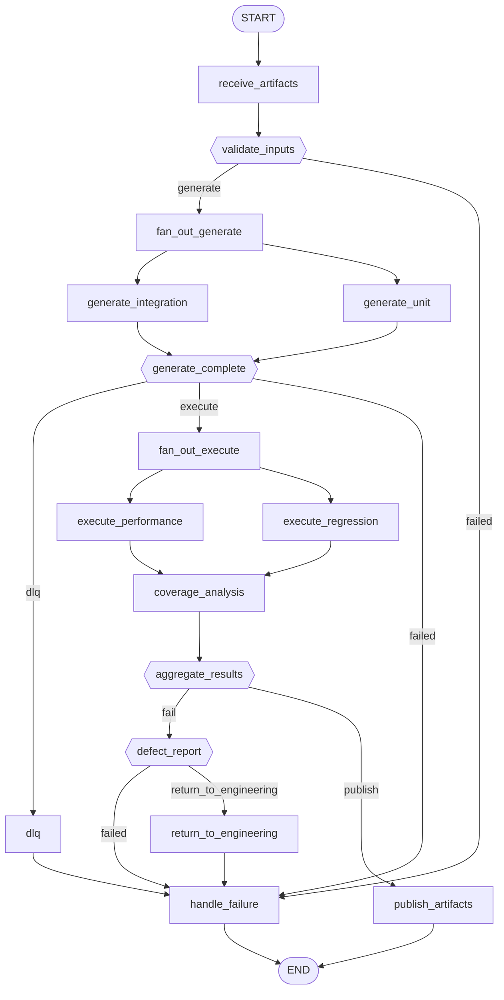

# Workflow: qa

**Status:** ✓ healthy

## Purpose

Generates and executes unit/integration/regression/performance test suites, dead-lettering tasks that exhaust retries, and gates publication on coverage + verdict.

## Nodes

- **Entry:** `receive_artifacts`
- **Finish:** `__end__`
- **All nodes (18):** `__end__`, `__start__`, `aggregate_results`, `coverage_analysis`, `defect_report`, `dlq`, `execute_performance`, `execute_regression`, `fan_out_execute`, `fan_out_generate`, `generate_complete`, `generate_integration`, `generate_unit`, `handle_failure`, `publish_artifacts`, `receive_artifacts`, `return_to_engineering`, `validate_inputs`

## Routing Table

| Source Node | Routing Function | Outcome | Target |
|---|---|---|---|
| validate_inputs | route_after_validate_inputs | failed | handle_failure |
| validate_inputs | route_after_validate_inputs | generate | fan_out_generate |
| generate_complete | route_after_generate | dlq | dlq |
| generate_complete | route_after_generate | execute | fan_out_execute |
| generate_complete | route_after_generate | failed | handle_failure |
| aggregate_results | route_after_aggregate | fail | defect_report |
| aggregate_results | route_after_aggregate | publish | publish_artifacts |
| defect_report | route_after_defect_report | failed | handle_failure |
| defect_report | route_after_defect_report | return_to_engineering | return_to_engineering |

## Parallel Branches

| Fan-out Node | Kind | Targets |
|---|---|---|
| fan_out_generate | static_edges | generate_integration, generate_unit |
| fan_out_execute | static_edges | execute_performance, execute_regression |

## Interrupt Nodes

_None._

## Diagram

## Statistics

| Metric | Value |
|---|---|
| Nodes | 18 |
| Edges | 24 |
| Graph depth | 13 |
| Average branching factor | 1.41 |
| Reachability | 100.0% |
| Dead ends | 0 |
| Cycles detected | 0 |
| Interrupt nodes | none |
| Checkpoint-capable | yes |
| Parallel branches | 2 |

## Warnings

_None._

## Errors

_None._
