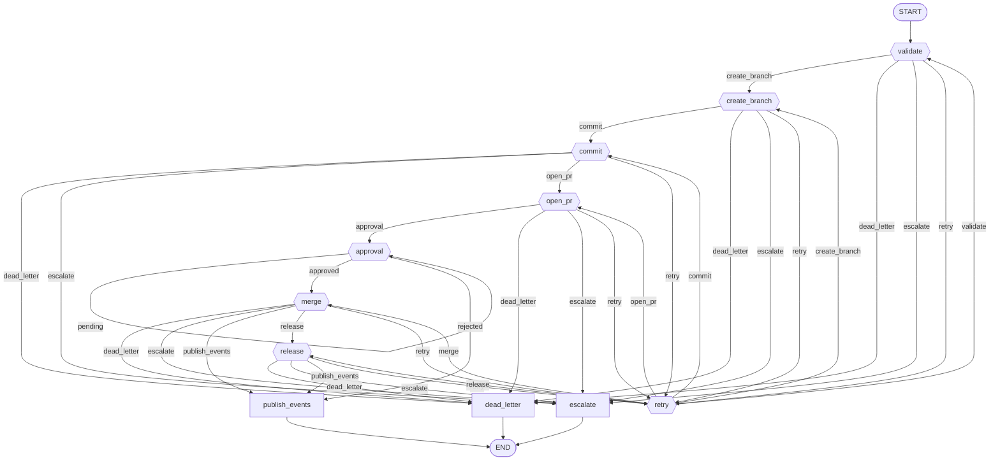

# Workflow: repository

**Status:** ✓ healthy

## Purpose

Source-control operations — branch, commit, PR, approval gate, merge, release; retries on transient failure.

## Nodes

- **Entry:** `validate`
- **Finish:** `__end__`
- **All nodes (13):** `__end__`, `__start__`, `approval`, `commit`, `create_branch`, `dead_letter`, `escalate`, `merge`, `open_pr`, `publish_events`, `release`, `retry`, `validate`

## Routing Table

| Source Node | Routing Function | Outcome | Target |
|---|---|---|---|
| validate | route_after_validate | create_branch | create_branch |
| validate | route_after_validate | dead_letter | dead_letter |
| validate | route_after_validate | escalate | escalate |
| validate | route_after_validate | retry | retry |
| create_branch | route_after_create_branch | commit | commit |
| create_branch | route_after_create_branch | dead_letter | dead_letter |
| create_branch | route_after_create_branch | escalate | escalate |
| create_branch | route_after_create_branch | retry | retry |
| commit | route_after_commit | dead_letter | dead_letter |
| commit | route_after_commit | escalate | escalate |
| commit | route_after_commit | open_pr | open_pr |
| commit | route_after_commit | retry | retry |
| open_pr | route_after_open_pr | approval | approval |
| open_pr | route_after_open_pr | dead_letter | dead_letter |
| open_pr | route_after_open_pr | escalate | escalate |
| open_pr | route_after_open_pr | retry | retry |
| approval | route_approval_gate | approved | merge |
| approval | route_approval_gate | pending | approval |
| approval | route_approval_gate | rejected | publish_events |
| merge | route_after_merge | dead_letter | dead_letter |
| merge | route_after_merge | escalate | escalate |
| merge | route_after_merge | publish_events | publish_events |
| merge | route_after_merge | release | release |
| merge | route_after_merge | retry | retry |
| release | route_after_release | dead_letter | dead_letter |
| release | route_after_release | escalate | escalate |
| release | route_after_release | publish_events | publish_events |
| release | route_after_release | retry | retry |
| retry | route_after_retry | commit | commit |
| retry | route_after_retry | create_branch | create_branch |
| retry | route_after_retry | merge | merge |
| retry | route_after_retry | open_pr | open_pr |
| retry | route_after_retry | release | release |
| retry | route_after_retry | validate | validate |

## Parallel Branches

_No parallel branches._

## Interrupt Nodes

approval

## Diagram

## Statistics

| Metric | Value |
|---|---|
| Nodes | 13 |
| Edges | 38 |
| Graph depth | 9 |
| Average branching factor | 3.17 |
| Reachability | 100.0% |
| Dead ends | 0 |
| Cycles detected | 7 |
| Interrupt nodes | approval |
| Checkpoint-capable | yes |
| Parallel branches | 0 |

## Warnings

_None._

## Errors

_None._
