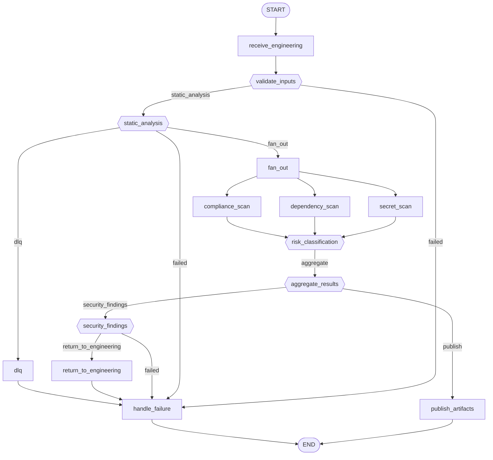

# Workflow: security

**Status:** ✓ healthy

## Purpose

Runs dependency, secret, and compliance scans over Engineering's output before DevOps.

## Nodes

- **Entry:** `receive_engineering`
- **Finish:** `__end__`
- **All nodes (16):** `__end__`, `__start__`, `aggregate_results`, `compliance_scan`, `dependency_scan`, `dlq`, `fan_out`, `handle_failure`, `publish_artifacts`, `receive_engineering`, `return_to_engineering`, `risk_classification`, `secret_scan`, `security_findings`, `static_analysis`, `validate_inputs`

## Routing Table

| Source Node | Routing Function | Outcome | Target |
|---|---|---|---|
| validate_inputs | route_after_validate_inputs | failed | handle_failure |
| validate_inputs | route_after_validate_inputs | static_analysis | static_analysis |
| static_analysis | route_after_static_analysis | dlq | dlq |
| static_analysis | route_after_static_analysis | failed | handle_failure |
| static_analysis | route_after_static_analysis | fan_out | fan_out |
| risk_classification | route_after_risk_classification | aggregate | aggregate_results |
| aggregate_results | route_after_aggregate | publish | publish_artifacts |
| aggregate_results | route_after_aggregate | security_findings | security_findings |
| security_findings | route_after_security_findings | failed | handle_failure |
| security_findings | route_after_security_findings | return_to_engineering | return_to_engineering |

## Parallel Branches

| Fan-out Node | Kind | Targets |
|---|---|---|
| fan_out | static_edges | compliance_scan, dependency_scan, secret_scan |

## Interrupt Nodes

_None._

## Diagram

## Statistics

| Metric | Value |
|---|---|
| Nodes | 16 |
| Edges | 22 |
| Graph depth | 11 |
| Average branching factor | 1.47 |
| Reachability | 100.0% |
| Dead ends | 0 |
| Cycles detected | 0 |
| Interrupt nodes | none |
| Checkpoint-capable | yes |
| Parallel branches | 1 |

## Warnings

_None._

## Errors

_None._
